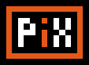

Welcome to **Pix**, arguably the pinnacle of CLI pixel art tools!

Pix is a minimalist image editor meticulously designed for pixel art and 2D animation, operating effortlessly in terminal emulators. Developed in Python and licensed under the GNU Affero General Public License, Pix is your streamlined command-line solution for crafting and editing pixel art. It’s stripped of unnecessary bloat while delivering essential features like mirroring and bucket fill. With its SSH compatibility, Pix is a groundbreaking tool for terminal-based pixel art creation in color!

## Made in pix:

## Mindset

If limitations fuel creativity, then prepare to experience one of the most creatively invigorating pieces of software in your lifetime. Welcome to Pix—where less is more, and imagination knows no bounds! Some ask, "Why reinvent the wheel?" To which I respond, "Wheels? Who needs them!" Pix isn't about sticking to the familiar; it's about blazing a new trail. Why settle for the mundane when you can craft your masterpiece with a tool that’s as innovative as your creativity?

## Features

Did you hear that Pix supports color? That’s right—up to 8 glorious colors at your fingertips! Forget about mice and other fancy equipment! Pix brings you the sophistication of keyboard controls only, demonstrating that you don’t need extravagant gadgets or cluttered interfaces to create stunning art. It’s a testament to the elegance of simplicity, where every stroke is guided by the precision of your keyboard. No mouse? No problem! With Pix, you’re in control, and your creativity knows no bounds. Embrace the future of pixel art with a touch of classic charm—Pix has it all!

## Tools

- **Dot tool:** A tool for placing single pixel.
- **Pen Tool:** Precision at your fingertips for those perfect pixel strokes.
- **Rect tool:** A tool for making rectangles.
- **Ellipse tool:** A tool for making ellipses.
- **Line tool:** A tool for making lines.
- **Bucket Fill:** Rapidly fill areas with your chosen color, with even more excitement on the way!
- **Copy tool:** To sample any color from the canvas.
- **Mirror Tools:** Effortlessly mirror your creations, whether horizontally, vertically, or both!

## License

This project is licensed under the [GNU Affero General Public License, Version 3](./LICENSE) (AGPLv3). See the [LICENSE](./LICENSE) file for more details.

## Source Code

The source code of the project can be found in <a href="./pix.py">pix.py</a>.

> **Pix**: "You ain't ready for it!"

---

2024. Made with ❤ by  

