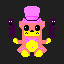

> Pixel-art Independent of X11 or P.I.X for short

Welcome to **Pix**, arguably the pinnacle of CLI pixel art tools!

Pix is a minimalist, keyboard-only pixel art editor with a basic CLI interface. By embracing a limited palette and simple tools, it challenges you to harness creativity within constraints. In a landscape where keyboard-only CLI tools are nearly non-existent, Pix stands out by turning minimalism into a powerful canvas.

## Overview

Pix is meticulously designed for 2D pixel art, operating effortlessly in terminal emulators like bash. Developed in Python and licensed under the [AGPLv3 License](./LICENSE), Pix is your streamlined command-line solution for crafting and editing pixel art. It’s stripped of unnecessary bloat while delivering the most essential features. Pix is the most basic tool for terminal-based pixel art creation in color!

## Mindset

If limitations fuel creativity, then prepare to experience one of the most creatively invigorating pieces of software in your lifetime. Welcome to Pix—where less is more, and imagination knows no bounds! Some ask, "Why reinvent the wheel?" To which I respond, "Wheels? Who needs them!" Pix isn't about sticking to the familiar; it's about blazing a new trail. Why settle for the mundane when you can craft your masterpiece with a tool that’s as innovative as your creativity?

## Made in pix:

I whipped up these examples back when Pix was barely holding itself together with duct tape and a few colors. If I could make something half-decent with that hot mess, just think of what you could create with a fully functional version!

## Features

Did you hear that Pix supports color? That’s right—up to 8 glorious colors at your fingertips! Forget about mice and other fancy equipment! Pix brings you the sophistication of keyboard controls only, demonstrating that you don’t need extravagant gadgets or cluttered interfaces to create stunning art. It’s a testament to the elegance of simplicity, where every stroke is guided by the precision of your keyboard. No mouse? No problem! With Pix, you’re in control, and your creativity knows no bounds. Embrace the future of pixel art with a touch of classic charm—Pix has it all!

**Additionally:**
Pix lets you load .hex files, just like those you find on sites like [Lospec](https://lospec.com/), or even create your own!

### Tools

- **Dot tool:** A tool for placing single pixel. 

> (This might be the simplest tool in the shed, but don’t let it know! It places dots—yes, dots are pixels. If you’re wondering why it’s not called the Pixel Tool, it’s because two tools starting with the same letter is a sin I can’t forgive! We already have the Pen Tool with a "P"—don’t be greedy. Why didn’t I name the Pen Tool something else? I didn’t think of anything better, so deal with it or contribute to the project, you cheeky devil!)

- **Pen Tool:** Imagine if you accidentally left the Dot Tool on and then tried to draw with it. Voilà, you’ve got the Pen Tool! It’s like a fancy line tool that sometimes just wants to take the scenic route.
- **Rect tool:** A tool for making rectangles. 

> (Because who doesn’t need a tool that makes rectangles? Forget rectums or rectifying anything; it’s just for rectangles. Now you know!)

- **Ellipse tool:** A tool for making ellipses 

> (Who could have guessed!).

- **Line tool:** A tool for making lines 

> (Who knew a Line Tool was for lines? Genius, right?)

- **Bucket Fill:** Rapidly fill areas with your chosen color, with even more excitement on the way! (Forget the bucket thing; it fills the area under the cursor with the selected color. Just play with it and you’ll get the hang of it. I’m not writing a “For Dummies” guide—figure it out yourself!)
- **Copy tool:** To sample any color from the canvas. 

> (Because “Pipette” and “Pick” both start with P, and we can't have that. I thought about calling it the “Clone Tool,” but “Copy” works too. Missed opportunity, but hey. )

- **Mirror Tools:** Effortlessly mirror your creations, whether horizontally, vertically, or both! 

> (Because “Reflect Tool” was too fancy and we ain't playing UNO in here. We’ve already got the Rect Tool with an “R.” Don’t even get me started on why two tools starting with the same letter is a no-no!)

## Itch.io

Check out the Pix program stable release on itch.io! It’s an alternative way to get the program and helps support its development through optional donations. Your contribution, no matter how small, is greatly appreciated. Visit [Pix on itch.io](https://amos-nimos.itch.io/pix) to download and support the project. Thank you!

## License

This project is licensed under the [GNU Affero General Public License, Version 3](./LICENSE) (AGPLv3). See the [LICENSE](./LICENSE) file for more details.

## Source Code

The source code of the project can be found in <a href="./pix.py">pix.py</a>.

> Pix: "Pixel Art at Your Fingertips, literally!"

---

2024. Made with ❤ by  

